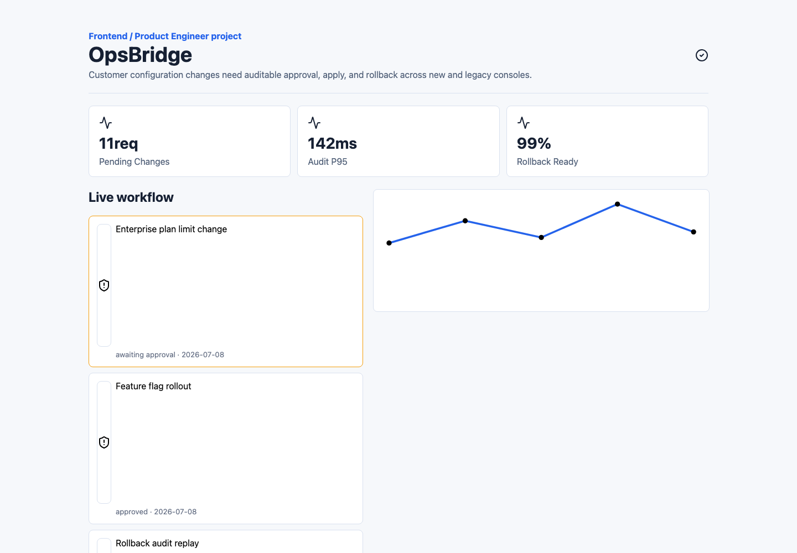

# OpsBridge Workspace

운영 변경 요청, 승인, 감사 로그, rollback 준비 상태를 추적할 수 있도록 만든 운영 워크플로우 대시보드 프로젝트입니다.

## 저장소 구성

- FE: [`opsbridge-fe`](https://github.com/opsbridge-labs/opsbridge-fe)
- BE: [`opsbridge-be`](https://github.com/opsbridge-labs/opsbridge-be)
- 개인 공개 미러: https://github.com/cyjoon68/opsbridge-workspace
- 기본 브랜치: `develop`

## 핵심 기능

- 운영 변경 요청 목록 확인
- 승인 대기/승인 완료/rollback 준비 상태 표시
- 감사 로그 검색 API
- D3 기반 운영 상태 추세 시각화
- MVC 구조 기반 변경 요청 controller/service/repository 분리

## 화면



## 기술 스택

- Frontend: React, TypeScript, ky, TanStack Query, D3
- Backend: Python, Flask, SQLAlchemy 2.0 Async Mode
- Database: PostgreSQL
- Infra/Test: Docker Compose, OpenAPI, pytest, k6, Playwright

## 실행

```bash
git submodule update --init --recursive

cd opsbridge-fe
npm install
npm run dev

cd ../opsbridge-be
python3 -m venv .venv
. .venv/bin/activate
pip install -r requirements.txt
pytest
```

## 데이터 흐름

```text
Ops Dashboard
  -> ky client
  -> Flask Controller
  -> Service
  -> SQLAlchemy Async
  -> PostgreSQL
```
